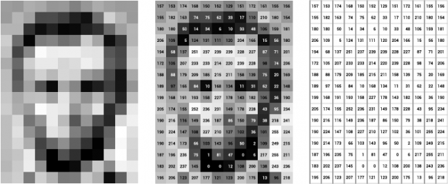
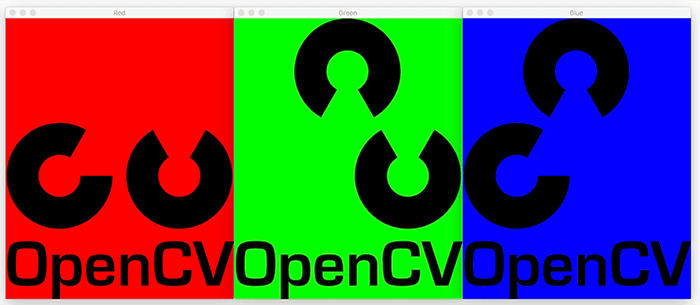
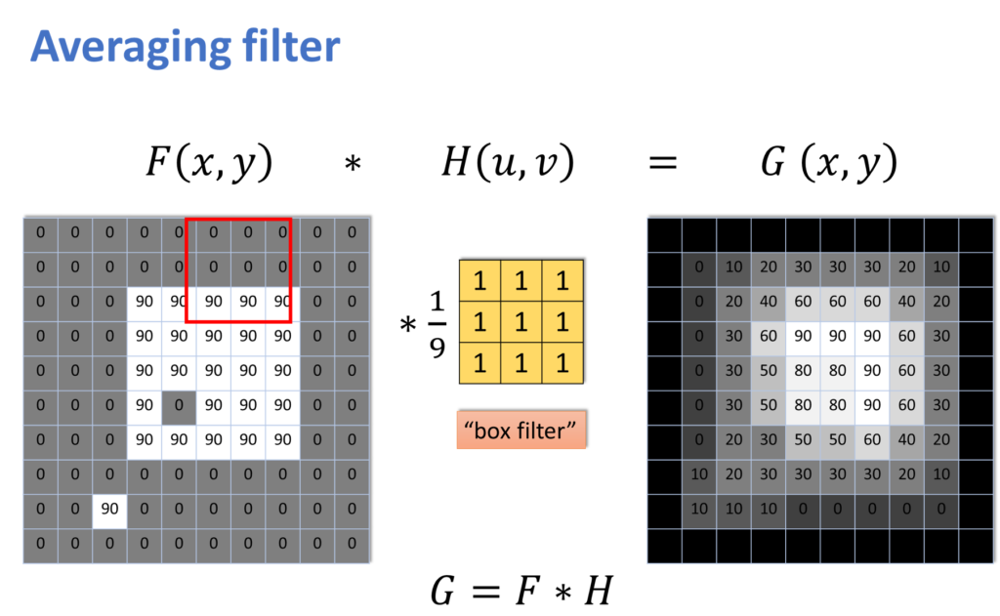

# OpenCV Examples

본 프로젝트는 OpenCV 의 간단한 기능들을 학습하고, 어떻게 사용하는지 알아보기 위한 학습용 프로젝트입니다.

## OpenCV란?

OpenCV(Open Source Computer Vision Library)는 오픈 소스 컴퓨터 비전 및 기계 학습 소프트웨어 라이브러리입니다. OpenCV는 컴퓨터 비전 애플리케이션을 위한 인프라를 제공하고 컴퓨터 비전을 쉽게 사용할 수 있도록 해 줍니다.

이때 컴퓨터 비전이란 말 그대로 컴퓨터를 사용하여 어떤 시각적인 작업을 처리하는 것을 말합니다. 이는 어떤 물체가 무슨 색인지 구분하는 간단한 작업에서부터, 바코드 / QR코드 등을 읽는 작업, 혹은 얼굴 인식을 통한 사람 구분 등 복잡한 작업까지 수많은 작업들을 포함합니다.

## OpenCV의 기초

OpenCV에서 가장 중요한 개념 중 하나는 컴퓨터상에서 이미지는 배열로 표현된다는 것입니다. 아래 간단한 예시가 있습니다.



이 예시에서는 어떤 이미지가 컴퓨터에서 어떻게 표현되는지를 보여줍니다. 왼쪽과 같은 이미지는 컴퓨터에서 오른쪽과 같이 단순한 숫자들의 나열로 표시됩니다.

이러한 숫자는 여러 범위를 가질 수 있습니다. 일반적으로는 완전히 검은색을 숫자 0, 완전히 흰색을 숫자 255로 나타냅니다.

> 이러한 범위를 가지는 이유는 한 픽셀을 한 바이트에 대응시키기 위함으로, 한 바이트가 가질 수 있는 숫자의 최소값이 0, 최대값이 255이기 때문입니다. 경우에 따라 실수형 자료를 사용하여 검은색을 0, 흰색을 1에 대응시키기도 합니다.

위 예시에서는 흑백 이미지를 표시했는데,  흑백 이미지에서는 한 픽셀을 표현하기 위해 밝기만 나타내면 되므로 하나의 숫자를 사용합니다. 일반적인 컬러 이미지에서는 R, G, B 세 가지 값의 조합으로 색을 표현하므로 한 픽셀을 나타내기 위해 세 개의 숫자를 사용합니다. 오른쪽과 같은 2차원 숫자 배열이 3개 있는 것으로 간주하면 됩니다. 이때 각 색을 나타내는 2차원 배열을 '채널(Channel)'이라 부릅니다.

> 투명도가 있는 이미지(png 등)을 나타내려면 투명도 값(Alpha)를 포함하여 R,G,B,A 네 가지의 채널이 필요합니다.

예컨대 아래와 같은 OpenCV 로고 이미지가 있습니다.


 이 이미지의 R, G, B 채널을 분해하면 아래와 같이 됩니다.



> 단, 일반적으로는 컬러 순서를 R, G, B 로 두지만 OpenCV에서는 반대로 B, G, R 순서로 둡니다.

## 예제

아래 예제를 수행하려면 Python 3 (3.8, 3.9 등)과 OpenCV가 설치되어 있어야 합니다. Python은 파이썬 홈페이지에서 설치 파일을 다운받아서 설치하면 되며, OpenCV는 터미널(cmd)를 열어 아래와 같은 명령어를 입력하면 설치됩니다.

```sh
pip3 install opencv-python
```

### 영상 출력해보기

가장 간단한 예시로, OpenCV에서 웹캠을 통해 영상을 출력해보겠습니다. 영상이란 사실 사진을 아주 빠르게 출력하는 것이므로 아래와 같이 While 구문을 사용하여 계속 프레임을 읽은 후 출력해주면 됩니다.

```python
import cv2

# Get videocapture object
cap = cv2.VideoCapture(0)

# Infinite loop
while True:
    # Read from cap. ret is flag for error detection
    ret, img = cap.read()
    # Show image
    cv2.imshow('myView', img)
    # Wait for rendering
    cv2.waitKey(1)
```

- VideoCaputure(0) 부분은 가장 0번째, 즉 첫 번째 비디오 장치를 열겠다는 의미로 컴퓨터에 웹캠이 여러 개 설치되어 있을 경우 0을 1, 2 등 다른 숫자로 바꾸면 다른 웹캠을 열 수 있습니다.

- cap.read() 함수는 비디오 장치에서 이미지를 읽어 오는 함수로 ret, img라는 두 개의 값을 반환합니다. ret은 이미지가 제대로 읽혔는지 알려주는 boolean 타입의 값이며 img는 실제 이미지를 담고 있는 배열입니다. 우리는 지금은 img만 신경쓰도록 하겠습니다. img는 일반적으로 세로x가로x3(R,G,B) 크기의 3차원 배열입니다.
- cv2.imshow() 함수는 이미지를 보여주는 함수입니다. 첫 번째 인자는 이미지를 보여 줄 윈도우의 이름이며 두 번째 인자는 이미지 배열을 넣어 주면 됩니다. 만약 이미지가 3차원 배열일 경우 컬러로, 2차원 배열일 경우 흑백으로 표시해줍니다.
  - 이 함수는 여러 번 호출되었을 경우 기존에 같은 이름을 가진 윈도우가 있으면 그 윈도우를 업데이트하고, 만약 그런 윈도우가 없으면 새로운 윈도우를 만듭니다.
- cv2.waitKey(1)은 어떤 키가 입력되었는지 1ms (=1/1000초)동안 기다리는 함수입니다. 만약 기다리는 동안 키가 입력되었을 경우 키 코드를 반환하고, 그렇지 않을 경우 -1을 반환합니다.
  - 이 함수를 넣어주는 이유는 윈도우에 이미지를 렌더링할 시간을 주기 위한 것으로, 이 함수를 넣지 않으면 이미지가 렌더링되기도 전에 새로 업데이트가 되면서 이미지가 제대로 보이지 않을 수 있습니다.
  - 그냥 기다리는 함수가 아니라 특정 키를 기다리는 함수를 넣은 이유는 나중에 이 함수의 반환값을 검사해서 특정한 키가 눌렸을 경우 프로그램을 종료하도록 설정하기 위해서입니다.

### 영상 크기 조정해보기

다음으로 이미지의 크기를 조정해보겠습니다. 이미지의 크기는 아무렇게나 변경할 수 있습니다. 그러나 일반적으로 영상의 크기를 줄이기 위해 사용되는데, 왜냐하면 영상처리를 하는 데에는 영상을 이루는 배열의 크기에 비례하여 시간이 소요되기 때문입니다. 즉, 이미지의 가로, 세로를 절반으로 줄이면 배열의 크기는 1/4로 줄어들고, 따라서 속도가 4배 빨라지는 효과를 얻을 수 있습니다.

```python
import cv2

cap = cv2.VideoCapture(0)

while True:
    ret, img = cap.read()
    # Resize image to W,H = 320,240
    img = cv2.resize(img, (320, 240))
    cv2.imshow('myView', img)
    cv2.waitKey(1)
```

위와 같이 cv2.resize() 함수를 호출해주면 영상 크기를 조절할 수 있습니다. 두 번째 인자로 주어진 (320, 240)은 '튜플(Tuple)' 이라는 자료구조로, 그냥 두 개의 숫자를 한 번에 입력할 수 있도록 하는 방법이라 생각하면 되겠습니다. 320, 240은 순서대로 가로, 세로 크기로, 단위는 픽셀입니다. 저 숫자를 마음대로 바꿔서 이미지가 어떻게 변하는지 확인해보기 바랍니다.

### 색 변환하기

앞서 말한 바와 같이 이미지 배열의 크기를 줄이면 처리 속도가 빨라집니다. 그래서 일반적으로 꼭 필요한 경우가 아니라면 영상처리는 컬러 이미지를 흑백으로 변환한 후 처리합니다. 그러면 채널이 3개에서 1개로 줄어들어 때문에 속도를 3배 올릴 수 있기 때문입니다.

```python
import cv2

cap = cv2.VideoCapture(0)

while True:
    ret, img = cap.read()
    img = cv2.resize(img, (320, 240))
    # Convert image to grayscale
    img = cv2.cvtColor(img, cv2.COLOR_BGR2GRAY)
    cv2.imshow('myView', img)
    cv2.waitKey(1)
```

위와 같이 cv2.cvtColor함수를 호출하면 컬러 이미지를 흑백 이미지로 변환할 수 있습니다. 이때 두 번째 인자로 넘겨주는 BGR2GRAY는 B, G, R 채널을 가진 이미지를 GRAY채널 하나로 변환하라는 의미입니다.

### 블러 처리하기

의외일 수도 있지만, 일반적으로 이미지를 블러 처리하는 경우가 많습니다. 그 이유는 이미지에 포함된 노이즈 때문으로, 이미지를 블러 처리하면 노이즈를 줄일 수 있기 때문입니다.

```python
import cv2

cap = cv2.VideoCapture(0)

while True:
    ret, img = cap.read()
    img = cv2.resize(img, (320, 240))
    img = cv2.cvtColor(img, cv2.COLOR_BGR2GRAY)
    # Blur image with 3x3 filter
    img = cv2.blur(img, (3, 3))
    cv2.imshow('myView', img)
    cv2.waitKey(1)

```

위와 같이 하면 이미지를 블러 처리할 수 있습니다. 컴퓨터에서는 어떤 픽셀의 값을 주변 픽셀의 값과 섞음으로써 블러 처리를 할 수 있습니다.



위와 같이 이미지의 일부분에 어떤 작은 다른 배열을 각각 곱한 후, 그 값을 평균내어 하나의 픽셀에 할당하는 것입니다. 위 이미지에서는 어떤 픽셀과 그 주변 8개 픽셀의 값을 평균하여 그 픽셀에 할당하여 블러 처리를 하고 있습니다.

>  이러한 연산을 Convolution이라 부르며, 곱해주는 작은 이미지 (위 그림에서 H)를 Filter 혹은 Kernel이라 부릅니다.

블러 연산에서는 Filter의 크기가 클수록 더욱 흐릿한 이미지를 얻습니다. 위 예시에서는 3 by 3 필터를 사용했습니다.

또 위 예시에서는 Filter의 값이 모두 1인데 이런 경우를 box Filter라 부릅니다. 이 값을 어떻게 설정하느냐에 따라 필터 종류가 달라집니다. 예컨대 필터의 값을 2차원 정규분포가 되도록 설정하면 Gaussian filter가 됩니다. Gaussian filter가 가장 성능이 좋다고 알려져 있으나, 속도가 비교적 느리다는 단점이 있습니다.

### 테두리 검출하기

글자 인식이나 QR코드 인식 등을 하려면 이미지에서 테두리를 인식할 필요가 있습니다. 컴퓨터 비전에서 테두리는 색이 갑자기 변하는 부분을 의미합니다. 수학적으로 표현하면, 이미지를 2차원 함수로 생각했을 때 Gradient의 절댓값이 큰 부분이라고 표현할 수 있습니다.

```python
import cv2

cap = cv2.VideoCapture(0)

while True:
    ret, img = cap.read()
    img = cv2.resize(img, (320, 240))
    img = cv2.cvtColor(img, cv2.COLOR_BGR2GRAY)
    img = cv2.blur(img, (3, 3))
    # Detect edge with Canny edge detection
    img = cv2.Canny(img, 50, 150)
    cv2.imshow('myView', img)
    cv2.waitKey(1)
```

테두리를 추출하기 위한 많은 방법들이 있습니다. 그중 일반적으로 많이 쓰이는 방법은 Sobel edge detector와 Canny edge detector입니다. Sobel은 성능은 조금 떨어지지만 속도가 빠르다는 장점이 있으며, Canny는 속도는 조금 느리지만 검출 성능이 뛰어납니다. 위 예시에서는 Canny edge detector를 사용하였습니다.

두 번째 인자와 세 번째 인자인 50, 150은 Canny edge detector의 파라매터로, 알고리즘의 난이도가 꽤 있으므로 설명은 생략하겠습니다.

### 이진화(Binarization)

경우에 따라 이미지를 흑백으로 구분하면 편리한 경우가 있습니다. 예컨대 QR코드를 인식하는 경우 이미지를 검은색과 흰색으로 구분하면 이후 알고리즘을 적용하기 편리할 것입니다. 이러한 과정을 이진화(Binarization)이라 부릅니다.

```python
import cv2

cap = cv2.VideoCapture(0)

while True:
    ret, img = cap.read()
    img = cv2.resize(img, (320, 240))
    img = cv2.cvtColor(img, cv2.COLOR_BGR2GRAY)
    img = cv2.blur(img, (3, 3))
    # Do binarization
    img[img > 128] = 255
    img[img <= 128] = 0
    cv2.imshow('myView', img)
    cv2.waitKey(1)

```

`img[img > 128] = 255`  이 부분이 조금 생소할 수 있습니다. 이는 OpenCV에서 제공하는 특수한 기능 두 가지를 이용한 것입니다.

-  먼저 `img > 128` 과 같이 어떤 배열과 숫자를 비교할 경우 각 원소 중 숫자보다 큰 경우 True, 그렇지 않으면 False인 배열이 생성됩니다.
- 배열에서 원소를 선택하는 부분(`[]`)에 숫자 대신 True, False로만 이루어진, 원래 배열과 크기가 같은 배열을 넣으면 배열에서 True에 해당하는 원소만 선택됩니다.
- 그러므로 `img[img > 128] = 255` 와 같이 하면 img 배열에서 그 값이 128보다 큰 원소만 선택하여 그 값을 255로 설정하라는 의미가 됩니다.
- 마찬가지로 `img[img <= 128] = 0`는 img 배열에서 그 값이 128보다 작거나 같은 원소를 0으로 바꾸라는 의미가 됩니다.

이때 경계값이 되는 128은 임의로 선택한 값입니다. 이 값을 역치(threshold)라 부릅니다. 이 역치는 경우에 따라 마음대로 선택할 수도 있지만, 이미지로부터 이 역치를 자동으로 계산할 수 있는 알고리즘도 있습니다. 아래 글을 참고하기 바랍니다.

- [https://darkpgmr.tistory.com/115](https://darkpgmr.tistory.com/115)

### 직선 검출

QR코드를 인식하거나 차선을 인식하는 프로그램을 짜려면 직선 검출을 할 수 있어야 합니다. 이때 많이 사용되는 알고리즘이 Hough Transform으로, 허프 변환이라 읽습니다.

```python
import cv2
import math

cap = cv2.VideoCapture(0)

while True:
    ret, org = cap.read()
    # Backup original image
    org = cv2.resize(org, (320, 240))
    img = cv2.cvtColor(org, cv2.COLOR_BGR2GRAY)
    img = cv2.blur(img, (3, 3))
    img = cv2.Canny(img, 50, 150)

    # Detect lines
    # img           = source image
    # 1             = resolution of parameter rho
    # 3.1415 / 180  = resolution of paramter theta in radian
    # 70            = threshold of line detection
    lines = cv2.HoughLines(img, 1, 3.1415 / 180, 70)

    # Loop for every detected line
    if lines is not None:
        for i in range(0, len(lines)):
            # Convert point from polar coordinate to euclidean coordinate
            rho = lines[i][0][0]
            theta = lines[i][0][1]
            a = math.cos(theta)
            b = math.sin(theta)
            x0 = a * rho
            y0 = b * rho
            pt1 = (int(x0 + 1000*(-b)), int(y0 + 1000*(a)))
            pt2 = (int(x0 - 1000*(-b)), int(y0 - 1000*(a)))
        
            # Draw lines on original image
            cv2.line(org, pt1, pt2, (0, 0, 255), 3, cv2.LINE_AA)

    # Show original image
    cv2.imshow('myView', org)
    cv2.waitKey(1)

```

허프 변환 알고리즘은 꽤 복잡하며 수학적인 이해가 필요하여 그 설명은 생략하겠습니다. 다만 위와 같이 `cv2.HoughLines` 함수를 사용하여 테두리가 검출된 이미지로부터 직선을 찾을 수 있으며, for문 안의 코드를 이용하여 이미지 위에 직선을 그릴 수 있다는 것 정도만 알아두기 바랍니다.

